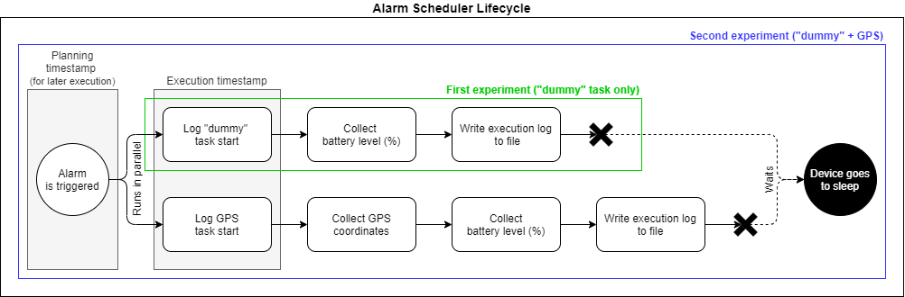

## goal

I think the main task to work in the coming weeks is the paper to describe the task scheduler

* Motivation, problem statement and related work
* Conceptual and technical description of the task scheduler
* Experimentation: design and execution
* Experimentation: comparative results
* Discussion & conclusion

### Experimentation: design and execution

who: Alberto, Miguel

I've implemented all the changes required in order to run both planned experiments:
* 1 min wake ups to run a "dummy" task
* 1 min wake ups to run a "dummy" task and a GPS data collection task (running in parallel)

To clarify how the task scheduler is going to behave I have created the following diagram:

Rounded square boxes represent the different tasks that have been implemented. Tasks with equal names are indeed the same tasks (thing that shows up that reusability is a first-class citizen in our solution). Another thing that I would like to clarify is that the planning timestamp of the first gray vertical box counts for the next execution, not the one that follows. So after each completely successful execution two rows appear on the log file:

* planning timestamp corresponding to this execution | dummy task start execution timestamp | battery (%) by the time the task finishes | "dummy" task type
* planning timestamp corresponding to this execution | GPS task start execution timestamp | battery (%) by the time the task finishes | "GPS" task type

Via calculating the difference between execution timestamp and planning timestamp, we can obtain the sleep time and the delay between the expected time (60k ms) and the actual execution time (~60k ms), as Carlos has already demonstrated.

### Data interpreation

